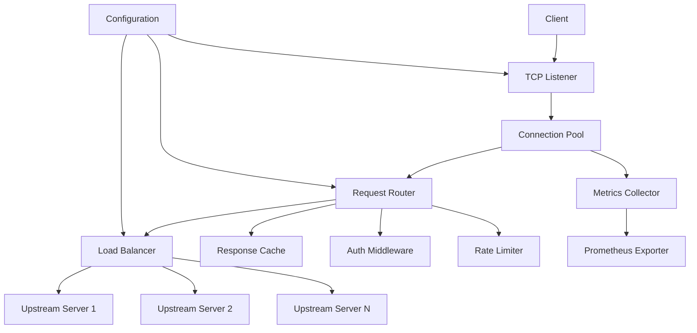
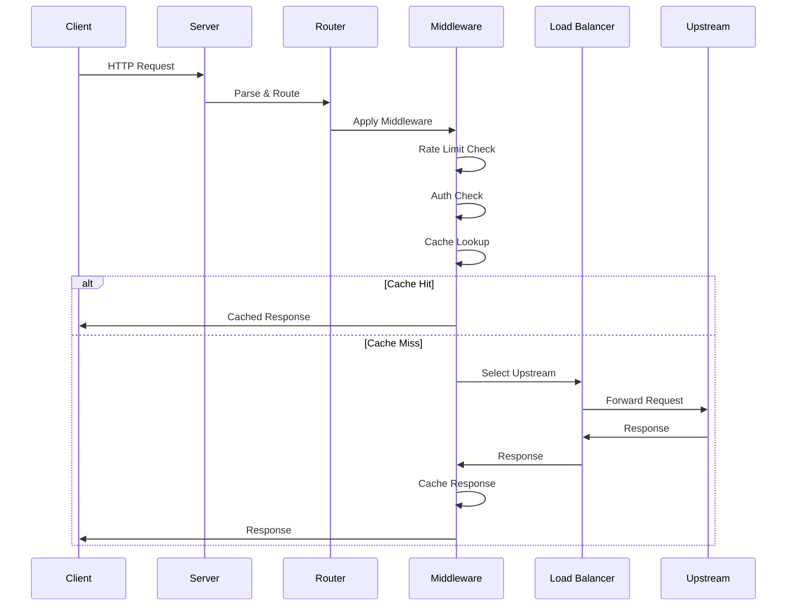

# Zoxy Architecture

This document describes the architecture and design principles of Zoxy.

## Design Principles

1. **Performance First**: Optimize for low latency and high throughput
2. **Memory Safety**: Leverage Zig's compile-time safety guarantees
3. **Simplicity**: Clear, maintainable code over clever abstractions
4. **Zero Dependencies**: Minimize external dependencies where possible
5. **Production Ready**: Design for reliability and observability from day one

---

## High-Level Architecture



---

## Core Components

### 1. Network Layer

**File**: `src/server.zig`

Handles low-level TCP/TLS connections.

**Responsibilities**:
- Accept incoming connections
- Manage connection lifecycle
- TLS termination
- Connection pooling
- Async I/O operations

**Key Design Decisions**:
- Use Zig's async/await for non-blocking I/O
- Connection pool per upstream server
- Configurable timeouts and buffer sizes

### 2. HTTP Parser

**File**: `src/http/parser.zig` (to be created)

Parses HTTP/1.1, HTTP/2, and HTTP/3 requests/responses.

**Responsibilities**:
- Parse HTTP headers and body
- Validate HTTP semantics
- Handle chunked encoding
- Support streaming

**Key Design Decisions**:
- Zero-copy parsing where possible
- Incremental parsing for streaming
- Strict RFC compliance with configurable leniency

### 3. Request Router

**File**: `src/router.zig` (to be created)

Routes requests to appropriate upstream servers.

**Responsibilities**:
- Match requests to routes
- Apply routing rules (path, host, headers)
- URL rewriting
- Header manipulation

**Key Design Decisions**:
- Trie-based routing for O(k) lookup (k = path length)
- Compiled regex patterns for performance
- Middleware chain pattern

### 4. Load Balancer

**File**: `src/loadbalancer.zig` (to be created)

Distributes requests across upstream servers.

**Responsibilities**:
- Select upstream server based on algorithm
- Track server health
- Handle failover
- Maintain connection pools

**Algorithms**:
- Round Robin
- Least Connections
- IP Hash
- Weighted Random

**Key Design Decisions**:
- Lock-free algorithms where possible
- Separate health check thread
- Exponential backoff for failed servers

### 5. Proxy Handler

**File**: `src/proxy.zig`

Forwards requests and responses between client and upstream.

**Responsibilities**:
- Forward HTTP requests
- Stream responses back to client
- Handle connection errors
- Implement retry logic

**Key Design Decisions**:
- Streaming response forwarding (no buffering)
- Configurable retry policies
- Circuit breaker pattern for failing upstreams

### 6. Configuration Manager

**File**: `src/config.zig`

Manages application configuration.

**Responsibilities**:
- Load configuration from files
- Validate configuration
- Hot reload support
- Provide configuration to other components

**Configuration Format** (YAML):
```yaml
server:
  port: 8080
  host: "0.0.0.0"
  tls:
    enabled: true
    cert: "/path/to/cert.pem"
    key: "/path/to/key.pem"

upstreams:
  - name: "backend"
    servers:
      - "http://localhost:3000"
      - "http://localhost:3001"
    load_balancing: "round_robin"
    health_check:
      interval: 10s
      timeout: 5s
      path: "/health"

routes:
  - path: "/api/*"
    upstream: "backend"
    rewrite: "/$1"
  - host: "example.com"
    upstream: "backend"

middleware:
  rate_limit:
    enabled: true
    requests_per_second: 100
  cache:
    enabled: true
    ttl: 300s
```

### 7. Middleware System

**File**: `src/middleware/` (to be created)

Extensible middleware for request/response processing.

**Built-in Middleware**:
- Rate Limiting
- Authentication
- Caching
- Logging
- Metrics
- CORS
- Compression

**Design**:
```zig
const Middleware = struct {
    const Handler = fn(*Request, *Response, NextFn) Error!void;
    const NextFn = fn(*Request, *Response) Error!void;
};
```

### 8. Metrics & Observability

**File**: `src/metrics.zig` (to be created)

Collects and exports metrics.

**Metrics**:
- Request count (by route, status code)
- Request duration (histogram)
- Active connections
- Upstream health status
- Cache hit/miss ratio
- Error rates

**Export Formats**:
- Prometheus
- JSON (for custom dashboards)
- StatsD

### 9. Cache Layer

**File**: `src/cache.zig` (to be created)

In-memory HTTP response cache.

**Responsibilities**:
- Cache HTTP responses
- Respect cache headers
- LRU eviction policy
- Cache key generation

**Key Design Decisions**:
- Lock-free concurrent hash map
- Configurable memory limits
- Support for cache invalidation

---

## Data Flow

### Request Processing Flow



---

## Concurrency Model

### Thread Architecture

```
Main Thread
├── Configuration Watcher
├── Metrics Collector
└── Worker Pool (N threads)
    ├── Worker 1: Handle Connections
    ├── Worker 2: Handle Connections
    └── Worker N: Handle Connections

Health Check Thread
└── Poll Upstream Servers
```

### Async I/O

- Use Zig's async/await for non-blocking operations
- Event loop per worker thread
- Shared-nothing architecture between workers

---

## Error Handling

### Error Types

```zig
const ProxyError = error{
    // Network errors
    ConnectionFailed,
    ConnectionTimeout,
    ConnectionReset,
    
    // HTTP errors
    InvalidRequest,
    InvalidResponse,
    UnsupportedProtocol,
    
    // Upstream errors
    NoHealthyUpstream,
    UpstreamTimeout,
    
    // Configuration errors
    InvalidConfiguration,
    ConfigurationNotFound,
};
```

### Error Recovery

1. **Connection Errors**: Retry with exponential backoff
2. **Upstream Errors**: Failover to healthy upstream
3. **Parse Errors**: Return 400 Bad Request
4. **Internal Errors**: Return 500, log for investigation

---

## Security Considerations

1. **Input Validation**: Strict HTTP parsing, reject malformed requests
2. **Resource Limits**: Connection limits, request size limits, timeout enforcement
3. **TLS**: Modern cipher suites only, certificate validation
4. **Rate Limiting**: Prevent abuse and DDoS
5. **Header Sanitization**: Remove/add security headers

---

## Performance Targets

| Metric | Target |
|--------|--------|
| Requests/sec | 100,000+ |
| P50 Latency | < 1ms |
| P99 Latency | < 10ms |
| Memory Usage | < 50MB base |
| CPU Usage | < 50% at 50K req/s |

---

## Testing Strategy

1. **Unit Tests**: All core components
2. **Integration Tests**: End-to-end request flows
3. **Load Tests**: Performance benchmarks
4. **Chaos Tests**: Failure scenarios
5. **Fuzz Tests**: Parser robustness

---

## Future Considerations

- **Plugin System**: Dynamic loading of custom middleware
- **Distributed Tracing**: OpenTelemetry integration
- **Service Mesh**: xDS API support
- **Multi-tenancy**: Isolated configurations per tenant
